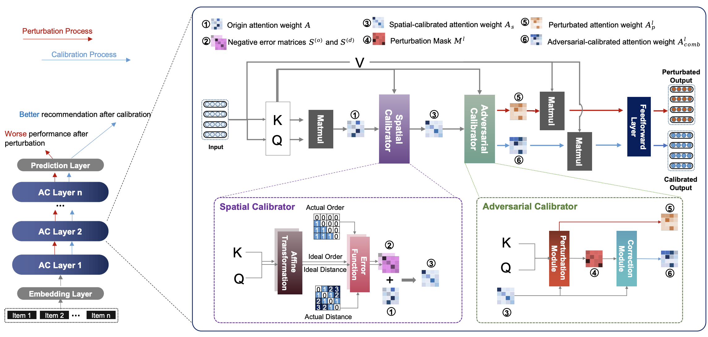

# Attention Calibration for Transformer-based Sequential Recommendation

> Peilin Zhou*, Qichen Ye*, Yueqi Xie, Jingqi Gao, Shoujin Wang, Jae Boum Kim, Chenyu You, Sunghun Kim

## Overview
We propose a simple yet effective framework called Attention
Calibration for Transformer-based Sequential Recommendation
(AC-TSR). In AC-TSR, a novel spatial calibrator and adversarial calibrator are designed respectively to directly calibrates those incorrectly assigned attention weights. The former is devised to explicitly
capture the spatial relationships (i.e., order and distance) among
items for more precise calculation of attention weights. The latter
aims to redistribute the attention weights based on each item’s contribution to the next-item prediction. AC-TSR is readily adaptable
and can be seamlessly integrated into various existing transformerbased SR models.


## Preparation
Please install the following packages

> - torch==1.11.0
> - numpy==1.19.2
> - einops==0.6.1
> - tensorboard==2.11.2

## Usage
**Step 1**: Download datasets from [RecSysDatasets](https://github.com/RUCAIBox/RecSysDatasets) or their [Google Drive](https://drive.google.com/drive/folders/1ahiLmzU7cGRPXf5qGMqtAChte2eYp9gI). And put the files in `./dataset/` like the following.

```
$ tree
.
├── Amazon_Beauty
│   ├── Amazon_Beauty.inter
│   └── Amazon_Beauty.item
├── Amazon_Toys_and_Games
│   ├── Amazon_Toys_and_Games.inter
│   └── Amazon_Toys_and_Games.item
├── Amazon_Sports_and_Outdoors
│   ├── Amazon_Sports_and_Outdoors.inter
│   └── Amazon_Sports_and_Outdoors.item
└── yelp
    ├── README.md
    ├── yelp.inter
    ├── yelp.item
    └── yelp.user

```

**Step 2**: run the following command to run AC-SASRec on a specific dataset, e.g. amazon-beauty

```
bash scripts/run_AC-SAS.sh amazon-beauty
```

**Tips** here we provide the hyper-parameters for AC-SASRec on for different datasets ('amazon-beauty', 'amazon-sports-outdoors', 'amazon-toys-games' and 'yelp'). Due to some stochastic factors as well as the different hard-ware environment you use, slightly tuning the hyper-parameters using grid search is necessary if you want to reproduce the performance.

## Cite Us
```
@misc{zhou2023attention,
      title={Attention Calibration for Transformer-based Sequential Recommendation}, 
      author={Peilin Zhou and Qichen Ye and Yueqi Xie and Jingqi Gao and Shoujin Wang and Jae Boum Kim and Chenyu You and Sunghun Kim},
      year={2023},
      eprint={2308.09419},
      archivePrefix={arXiv},
      primaryClass={cs.IR}
}
```

## Acknowledgement

This repo is based on [Recbole](https://github.com/RUCAIBox/RecBole)
